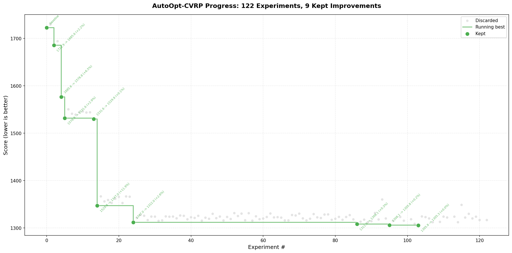

# AutoOpt



[autoresearch](https://github.com/karpathy/autoresearch) but for optimization.

Give it a problem, a bad heuristic, and a local LLM. It runs experiments in a loop: the AI proposes a code change to the heuristic, the orchestrator evaluates it on benchmark instances, and if the score improves, it commits. If it crashes or regresses, it reverts. Repeat. You wake up to a better solver.

The AI doesn't just suggest ideas — it writes the code, gets scored, and learns from what worked and what didn't. The repo is deliberately kept small. Three files matter:

- **`program.md`** — instructions for the agent. Your "system prompt" for the optimization research org. Not modified by the agent.
- **`heuristic.py`** — the living code. Starts as a dumb greedy, gets rewritten experiment by experiment. **This file is edited by the agent.**
- **`run_experiment.py`** — the orchestrator. Sends current code + history to the LLM, evaluates proposals, decides accept/reject, commits. Not modified by the agent.

## The score

The metric is **mean total distance** across a fixed set of 10 CVRP instances — lower is better.

Each instance has 50 customers with random coordinates and demands. The heuristic must produce feasible routes: every customer visited exactly once, no vehicle exceeds capacity, all routes start and end at the depot. If a solution is infeasible, its score gets heavily penalized. If the code crashes, the experiment is rejected.

The score reported in commits and logs is the **average Euclidean distance** across all 10 instances. When we say "score 1723 → 1686 (+2.2%)", that means the total route length dropped by 2.2% on average. This is the only metric that matters for acceptance: `new_score < best_score`.

## First target: CVRP

The **Capacitated Vehicle Routing Problem** — a classic NP-hard problem in operations research. Given customers with demands and a fleet of capacity-limited vehicles, find the shortest routes from a depot that serve everyone.

Starting from a naive Nearest Neighbor (score ~1723), the agent has run **122 experiments across 2 sessions**, accepting **9 improvements**:

```
Run 1 (84 experiments, 6 accepted):
  exp#2:  1722.9 → 1685.6  (+2.2%)    greedy improvements
  exp#4:  1685.6 → 1576.8  (+6.5%)    2-opt local search
  exp#5:  1576.8 → 1531.6  (+2.9%)    Clarke-Wright construction
  exp#13: 1531.6 → 1529.8  (+0.1%)    tuning
  exp#14: 1529.8 → 1347.0  (+11.9%)   inter-route operators
  exp#24: 1347.0 → 1312.0  (+2.6%)    ILS with Or-opt + Exchange

Run 2 (39 experiments, 3 accepted):
  exp#2:  1311.9 → 1308.1  (+0.3%)    greedy best insertion
  exp#11: 1308.1 → 1305.8  (+0.2%)    2-opt* inter-route
  exp#19: 1305.8 → 1305.3  (+0.0%)    fine-tuning
```

**Total improvement: ~24% reduction in distance** (1723 → 1305), fully autonomously. The heuristic went from a one-liner greedy to a full Iterated Local Search with Clarke-Wright construction, 2-opt, Or-opt, exchange operators, and 2-opt* cross-exchange — all written by a 27B parameter model running locally.

## Quick start

```bash
# 1. Have Ollama running with your model
ollama list

# 2. Install dependencies
pip install requests

# 3. Run the autonomous loop
cd autoopt-cvrp
python run_experiment.py --n-experiments 100 --time-limit 30

# 4. Plot progress at any time
python plot_progress.py
```

The loop prints progress in real time. Each accepted improvement gets a git commit. You can stop and resume — it picks up from the current `heuristic.py` and log.

## Structure

```
autoopt-cvrp/
├── program.md          # research directives for the agent
├── heuristic.py        # current heuristic (modified by the agent)
├── prepare.py          # instance generator + evaluator (fixed)
├── run_experiment.py   # orchestrator (fixed)
├── bks.py              # best known solutions for benchmarks
├── plot_progress.py    # plot experiment progress
├── instances/          # CVRP benchmark instances
└── results/            # experiment_log.jsonl
```

## Design choices

**Why a local model?** This runs Qwen 27B via Ollama. It's free, private, and fast enough. You could swap in any model — the orchestrator just needs an endpoint that returns text with a code block.

**Why git commits?** Every accepted improvement is a commit. Full history of what worked, easy to bisect regressions, fully auditable.

**Why one change at a time?** The agent proposes one modification per experiment. Easy to attribute improvements to specific changes. The history of accepted/rejected attempts is useful signal for the agent itself.

**Why CVRP?** Well-studied problem with known benchmarks, NP-hard (so heuristics matter), and the solution space is rich — construction heuristics, local search operators, metaheuristics. But the framework generalizes to any problem where you can score a solution.

## What's next

- More problem types (TSP, bin packing, job shop scheduling)
- Multi-objective optimization
- Better agent memory and strategy selection
- Evaluation against state-of-the-art solvers
